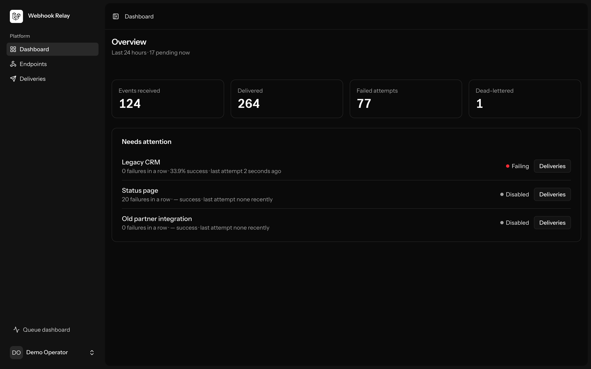
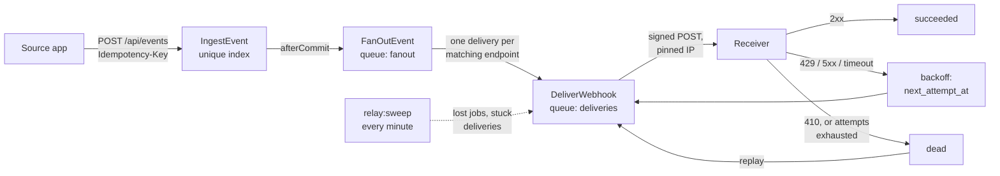
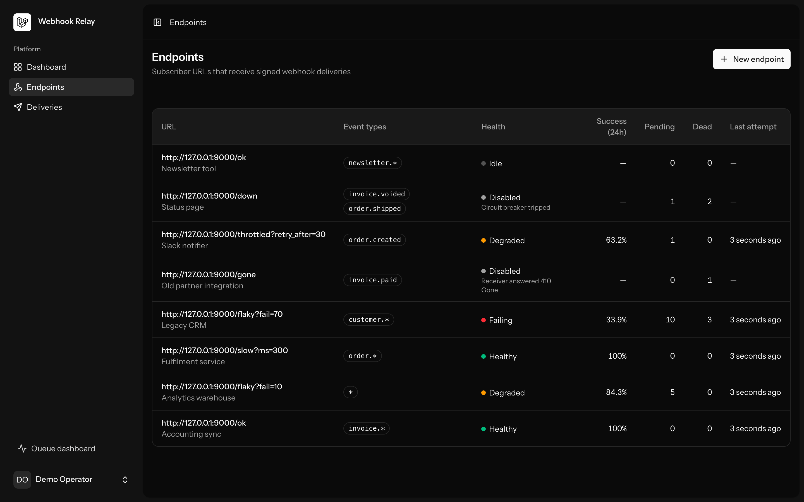
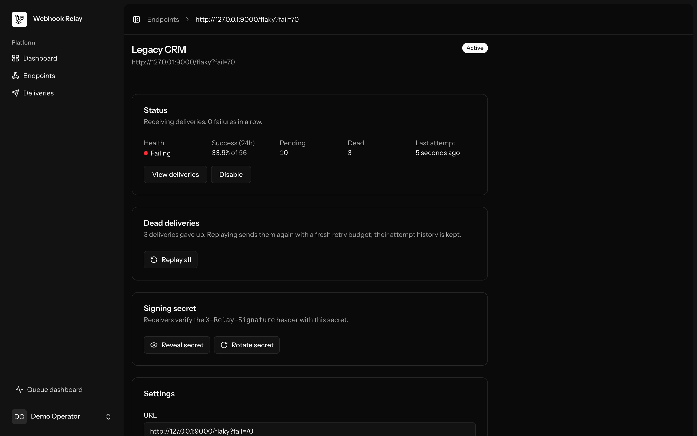
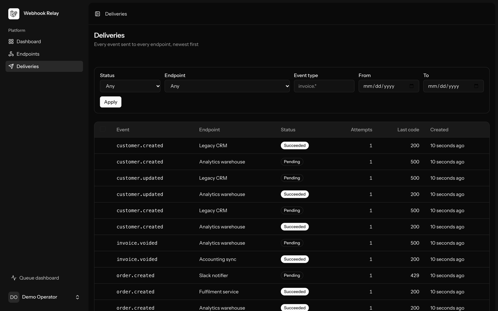
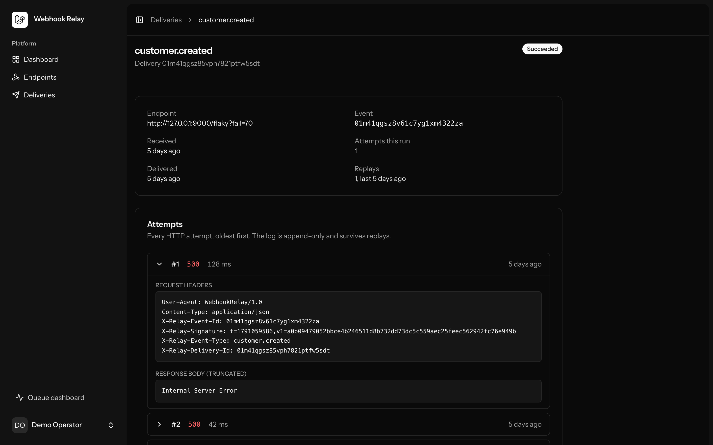
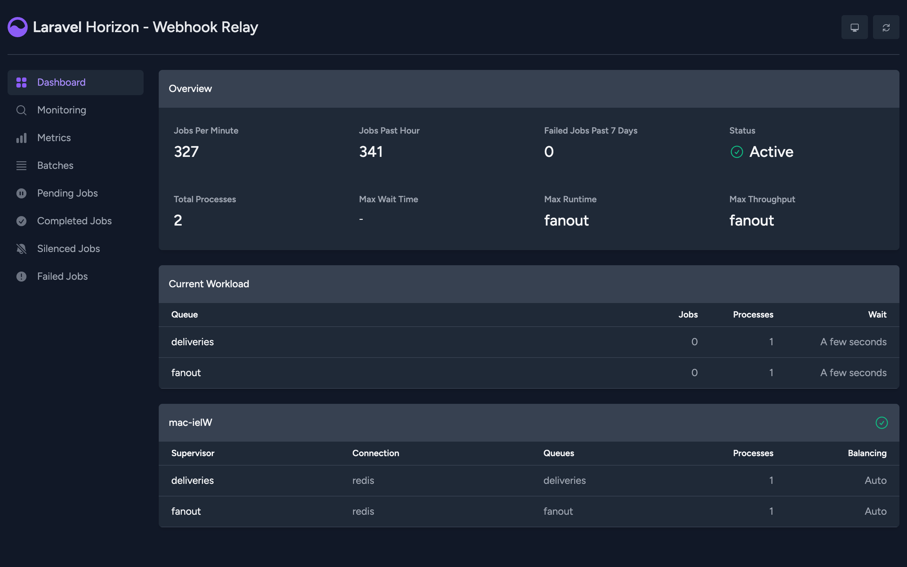
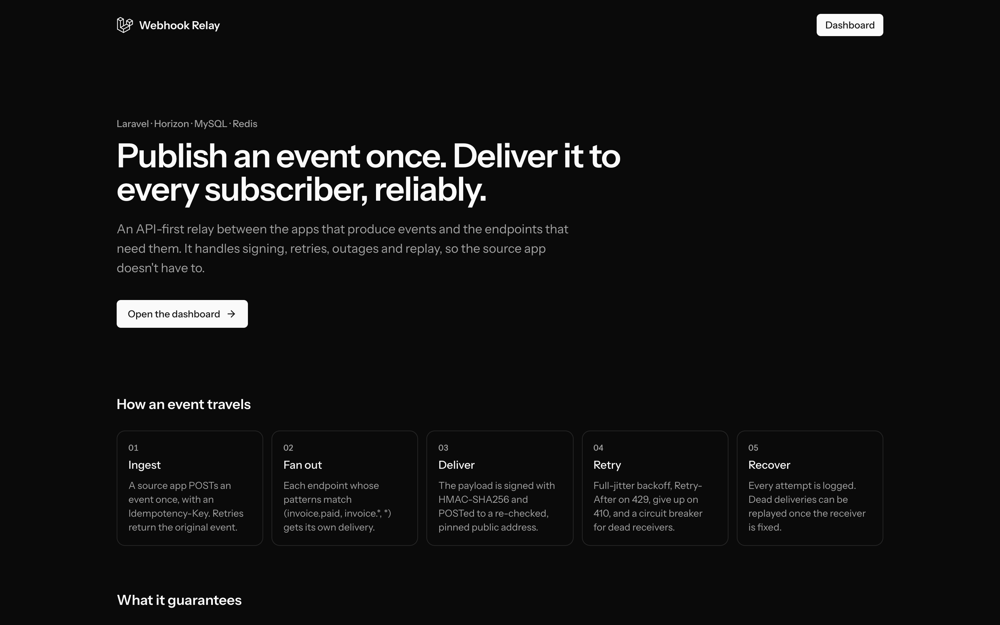

# Webhook Relay

An API-first Laravel service that accepts events from source apps and reliably delivers them to subscriber endpoints. Sources publish once. The relay signs each delivery, retries with backoff, survives receiver outages, and gives operators visibility and one-click replay.



## What it does

- **Idempotent ingest.** `POST /api/events` with an `Idempotency-Key`. A retried publish returns the original event (`200`) instead of creating a second one. The unique index decides, not a check-then-insert, and a multi-process test proves it.
- **Fan-out with patterns.** Endpoints subscribe to exact types (`invoice.paid`), prefixes (`invoice.*`) or everything (`*`). Matching runs in SQL.
- **Signed delivery.** `X-Relay-Signature: t=…,v1=…` (HMAC-SHA256 of the timestamp and raw body). During a secret rotation, both the new and the old secret sign each delivery for 24 hours, so receivers don't drop anything.
- **Retries that respect receivers.**
    - Exponential backoff with full jitter, about 6 hours at most over 8 attempts.
    - `Retry-After` honoured on `429`, and `410 Gone` disables the endpoint.
    - Per-endpoint rate limiting, and a circuit breaker that parks a receiver that keeps failing.
- **Dead-lettering and replay.** Deliveries that run out of attempts are kept. They can be replayed one at a time, as a selection or all at once, with a fresh retry budget and the attempt history kept.
- **SSRF protection.** Private, loopback, link-local and reserved addresses are refused when an endpoint is saved, and again at send time, with the connection pinned to the address that was checked.
- **Observability.**
    - Endpoint health (healthy, degraded, failing, disabled, idle).
    - A filterable, cursor-paginated delivery log.
    - The full attempt timeline, with request headers, response and timing.
    - Horizon for the queues.
- **A receiver package.** [`packages/relay-signature`](packages/relay-signature) holds the signing scheme, a framework-free `Verifier`, and a Laravel middleware for receivers. The relay signs with it, and [transaction-categorizer](https://github.com/zasmall/Transaction-categorizer) verifies with it.

## How an event travels



## Design decisions

Each of these is explained in [docs/ARCHITECTURE.md](docs/ARCHITECTURE.md).

- **The database is the source of truth for retries.** A failed delivery goes back to `pending` with `next_attempt_at`, and a delayed job is the fast path. If Redis loses the job, the per-minute sweep picks the delivery up when it's due, and it also resets deliveries stranded by a killed worker. Releasing the job instead would keep the schedule only in Redis.
- **A delivery is never in flight twice.** `DeliverWebhook` is `ShouldBeUniqueUntilProcessing`: the lock is held while the job waits (including delayed retries) and released just before it runs, so the job can schedule its own retry. A conditional `UPDATE … WHERE status = 'pending'` claim guards the request itself.
- **At-least-once, not exactly-once, and not ordered.** Receivers dedupe on the event id in the signed body. Ordering would mean one delivery per endpoint at a time, which lets one slow event block every later one.
- **Run attempts vs. lifetime attempts.** `deliveries.attempts` counts the current run, so a replay resets the retry budget. Attempt rows are numbered across the delivery's whole life, so the history survives replays without colliding.
- **Re-checking the address at send time.** DNS can change after an endpoint is saved (DNS rebinding). Every delivery re-resolves the host, refuses non-public addresses, pins cURL to the checked IP, and never follows redirects.
- **ULIDs as a time index.** Delivery ids start with their creation time, so the log turns a date filter into a primary-key range: 0.15 ms against 20 ms at 100k rows, and one less index to maintain.
- **Strict models outside production.** N+1 lazy loading, silently dropped mass-assignment attributes and unselected columns all throw in tests. It caught a test whose setup had been silently discarded.

## Running locally

Requires PHP 8.4, Composer, Node 22+, MySQL 8+ and Redis. There's no Docker: the app runs against local MySQL and Redis services (for example from Homebrew).

```bash
composer install && npm install
cp .env.example .env && php artisan key:generate
mysql -uroot -e "CREATE DATABASE webhook_relay_service; CREATE DATABASE webhook_relay_service_test;"
php artisan relay:demo
composer dev
```

- `relay:demo` loads a week of history: eight endpoints in every health state, with retries, dead-letters and a replay.
- `composer dev` runs the app server, Horizon, the scheduler (which runs `relay:sweep`), the mock receiver on port 9000, logs and Vite.

Open <http://localhost:8000>, set `RELAY_DEMO=true` to show the demo login on the landing page, and log in as `demo@example.com` / `password`. To watch deliveries happen live:

```bash
php artisan relay:demo:traffic --rate=2
```

The demo endpoints point at the [mock receiver](tools/mock-receiver/index.php). It verifies signatures with the receiver package and behaves according to the path: `/ok`, `/flaky?fail=40`, `/slow?ms=2000`, `/down`, `/gone`, `/throttled?retry_after=30`.

There's no public sign-up. Create operators with `php artisan relay:user:create "Name" email@example.com`.

## Using the API

```bash
# A source app gets a token for publishing.
php artisan relay:source:create billing-app

curl -X POST http://localhost:8000/api/events \
  -H "Authorization: Bearer $SOURCE_TOKEN" \
  -H "Idempotency-Key: order-1042-paid" \
  -H "Content-Type: application/json" -H "Accept: application/json" \
  -d '{"type":"invoice.paid","payload":{"invoice_id":"inv_42"}}'
# 202 Accepted; the same key again returns 200 with the original event.

# Operators manage endpoints with their own token.
php artisan relay:user:token ops@example.com

curl -X POST http://localhost:8000/api/endpoints \
  -H "Authorization: Bearer $OPERATOR_TOKEN" \
  -H "Content-Type: application/json" -H "Accept: application/json" \
  -d '{"url":"https://example.com/webhooks","event_types":["invoice.*"]}'
# 201 Created, with the signing secret shown once.
```

The rest of the API:

- Endpoints: `GET/PATCH/DELETE /api/endpoints/{id}` and `POST /api/endpoints/{id}/rotate-secret`.
- Deliveries: `GET /api/endpoints/{id}/deliveries?status=dead` and `GET /api/deliveries/{id}`.
- Replay: `POST /api/deliveries/{id}/replay`, or `POST /api/endpoints/{id}/replay` with `{"delivery_ids": [...]}` or `{"all": true}`.

Source tokens can only publish, and operator tokens can only manage.

**Receiving** in Laravel, with the package:

```php
// RELAY_WEBHOOK_SECRET=whsec_...  (comma-separate two while rotating)
Route::post('webhooks/relay', ReceiveRelayWebhook::class)->middleware('relay.signature');
```

## Testing

```bash
composer ci:check     # frontend lint/format, vue-tsc, Pint, PHPStan (level 7), Pest
cd packages/relay-signature && composer install && vendor/bin/pest
```

The suite is about 290 tests against real MySQL; the package has its own 39. Some notable ones:

- A concurrency test races 8 PHP processes on the same idempotency key. It's verified to fail against a check-then-insert implementation.
- A test runs the mock receiver as a real `php -S` process.
- The signer is checked against HMAC vectors computed with `openssl`.

## Project layout

```
app/Actions        Business logic: IngestEvent, CreateDeliveries, SendDelivery, HandleDeliveryResult, ReplayDeliveries, …
app/Jobs           FanOutEvent, DeliverWebhook (orchestration only)
app/Queries        DeliveryLogQuery, EndpointStatsQuery, DashboardSummaryQuery
app/Support        RetrySchedule, RetryAfter, EventTypePattern, OutboundAddressGuard
config/relay.php   Every tunable: backoff, attempts, timeouts, breaker, rate limit, health thresholds
packages/relay-signature   Signer, Verifier, VerifyRelaySignature middleware
tools/mock-receiver        Demo receiver
docs/ARCHITECTURE.md       Design, data model, decisions, query plans
```

## Screenshots

|                                                                                          |                                                                                                      |
| ---------------------------------------------------------------------------------------- | ---------------------------------------------------------------------------------------------------- |
|    |             |
|          |  |
|  |                                                         |

## What I'd do next

- **Publish `relay-signature` from its own repo** (a read-only split of `packages/relay-signature`), so receivers can install it from Packagist instead of a local path.
- **Retention.** Archive or prune old succeeded and dead deliveries and their attempts. Dead rows are never pruned today, and the backlog and dead-in-24h queries grow with them.
- **An egress proxy** (such as Smokescreen) for SSRF defense in depth, and so receivers can allowlist the relay's IPs.
- **Tenancy.** Endpoints owned by teams, and per-source subscriptions instead of one global endpoint list.
- **Token management in the dashboard**, instead of artisan commands only.
- **An OpenAPI spec** for the API, and metrics export (delivery latency and success rate per endpoint) for Prometheus or OpenTelemetry.
- **Opt-in ordered delivery per endpoint**, for receivers that need it, accepting head-of-line blocking.
